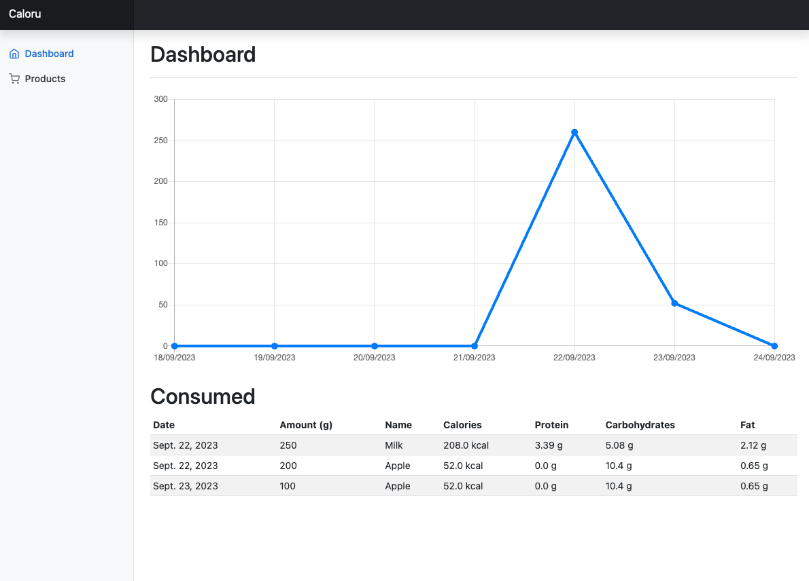
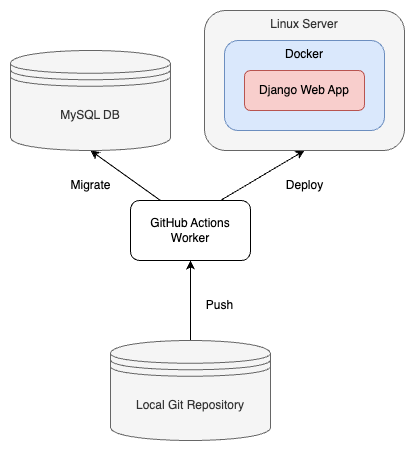

# Caloru - web calorie tracker
Simple web calorie tracker created with Django, MySQL and Bootstrap.

TODO(Introduction)



## Technologies
* Python 3.11
* Django 3.2.16
* Bootstrap 5.3.0
* MySQL
* GitHub Actions

## Deployment



## Setup
Setup Python virtualenv
```
cd ./caloru
python3 -m venv ./venv/
source ./venv/bin/activate
pip3 install -r requirements.txt
```

Apply database migrations
```
python3 manage.py migrate
```

Run development server
```
python3 manage.py runserver
```
